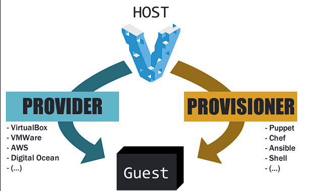

# VAGRANT BOXES



## Getting Started

Project for publish my custom vagrant boxes. I use windows for building my custom boxes local.

Adjust scripts for build in another platform.

## Pre-Requisites

- [Git](https://git-scm.com/doc)
- [Vagrant](https://www.vagrantup.com/docs/index.html)
- [Virtual Box](https://www.virtualbox.org/wiki/Documentation)
- [VMWare](https://www.vmware.com/products/workstation-pro.html)

For build all custom boxes in specific provider see below.

## Boxes Virtualbox

```powershell
cd virtualbox
& build-all.ps1
```

## Boxes VMWare

For build all custom boxes in vmware provider, you need to execute the following command:

```powershell
cd vmware
& build-all.ps1
```

## License

- This project is licensed under the MIT License - see the  [LICENSE.md](./LICENSE) file for details.

## References

[Vagrant VMWare](https://developer.hashicorp.com/vagrant/docs/providers/vmware)
